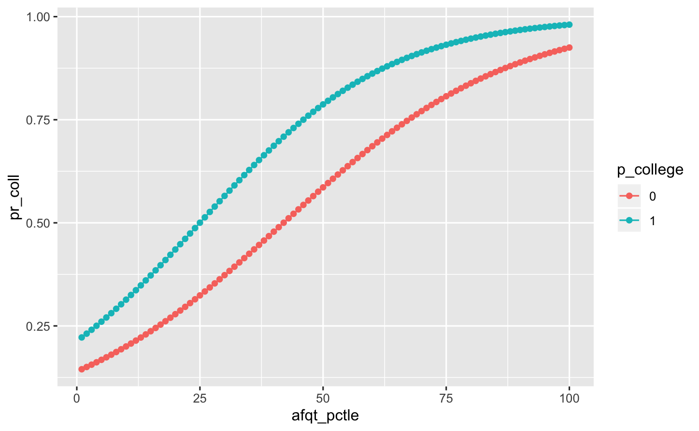
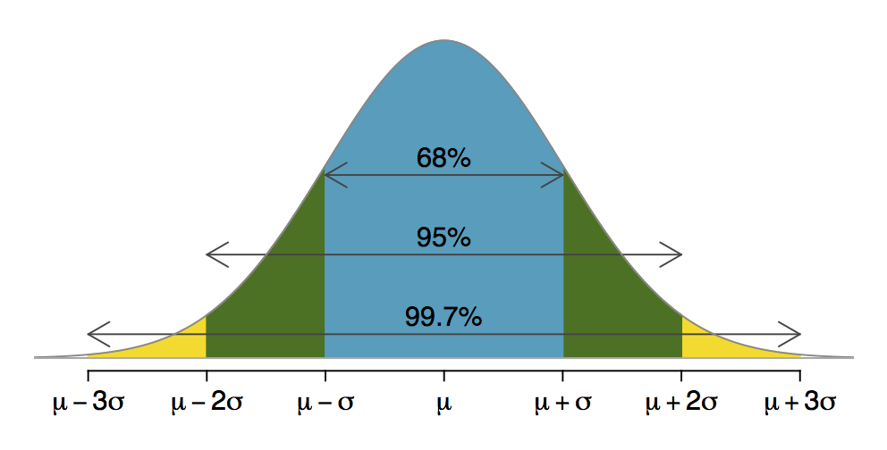

```{r, include = FALSE, warning = FALSE, message = FALSE}
counties <- read.csv("https://raw.githubusercontent.com/mjclawrence/soci385/master/data/counties.csv")
library(tidyverse)
library(pander)
counties <- filter(counties, !is.na(teen_birthrate))
```

# Introducing Probability

### So far: Summarizing observed values of variables
- Descriptions about the centers and shapes of distributions

--

### Today: Estimating probability of observing value in the sample
- Or, quantifying chance that a value is different from what is observed

--

### Up next: Inference
- What is the probability that a sample statistic is different from a population parameter?

---

# Thinking Probabilistically

### From observations to "random variables"
- Has a value from the set of possible values but we don't know what the value exactly is before it is observed

--

### From describing precision...
- 25% of commuting zones spend more than the national average on school expenditures

--

### To quantifying likelihood...
- 2.5% chance that a commuting zone we randomly pull from the data set will spend more than Addison County does on school expenditures

---

# Sociological Relevance of Probability

### Wildeman (2009): "Parental Imprisonment, the Prison Boom, and the Concentration of Childhood Disadvantage"

--

### Probability of parental imprisonment by age 14 for children born in 1990

--

- For white children: 0.04

--

- For black children: 0.25

--

- For black children born to high school dropouts: 0.5

--

### Example of *cumulative* probability: probability by age 14 is sum of probabilities in each previous year

---

# Another Example - Chris' Senior Project!



---

# Rules of Probability

### Probabilities usually described between 0 and 1

--

### Probabilities of each possible outcome always sum to 1
- For rolling a die:
- P(A=1) + P(A=2) + P(A=3) + P(A=4) + P(A=5) + P(A=6) = 1

--

### Probability of each possible outcome and its *complement* always sum to 1
- P(A=1) + P(A $\neq$ 1) = 1
- Following same rule, P(A=1) = 1 - P(A $\neq$ 1)

--

### Basic math opens lots of doors!

---

# Probability Distributions

### Rules so far work well for discrete variables

--

### For continuous variables (like birth rate), probability of a precise number is too small to be measured

--

### For continuous variables, better to think of probability in ranges

--

- What is the probability that a random variable *X* takes a value more extreme than our observed *x*?

--

### For now, assume variable is normally distributed, and apply what we know about means and standard deviations in normal distributions...

---

# Normal Distribution



---

# Probability Distributions

### Strategy is to find a value's distance from the mean in standard deviations. This measure is called the `z-score`.

--

### $\Large{z = \frac{x - \mu}{\sigma}}$

--

### Positive z-score is a value's distance above the mean in standard deviations

### Negative z-score is a value's distance below the mean in standard deviations

--

### Let's go back to `R`...


---

# Calculating Z Scores

### Remember that for our rules of probability distributions to work we assume we have a normal distribution. Is `teen_birthrate` normally distributed?

--

```{r, eval = FALSE}
ggplot(counties, aes(x = teen_birthrate)) + 
     geom_density() +
     labs(x = "Teen Birthrate", y = "Density")
```

---

# Calculating Z Scores

```{r, echo = FALSE, fig.height=8, fig.width = 12}
ggplot(counties, aes(x = teen_birthrate)) + 
     geom_density() +
     labs(x = "Teen Birthrate", y = "Density") +
     theme(axis.title = element_text(size = 24), 
           axis.text = element_text(size = 20))
```

---

# Calculating Z Scores

### For each observation, we need to find the difference from the mean and then divide that difference by the standard deviation.

--


```{r}
counties <- mutate(counties, teen_birthrate_z = 
                  (teen_birthrate - mean(teen_birthrate)) /
                               sd(teen_birthrate))
```

---

# Calculating Z Scores

### Z-scores should be normally distributed with a mean of 0 and a standard deviation of 1. Were we successful?

--

```{r}
summary(counties$teen_birthrate_z)

sd(counties$teen_birthrate_z)
```

---

# Interpreting Z-Scores

### What is the z-score for Addison County, Vermont's birth rate?

--

```{r}
counties$teen_birthrate_z[counties$county=="Addison" & 
                  counties$state=="Vermont"]
```

--

### In words, Addison County, Vermont's birth rate is 1.76 standard deviations below the mean birth rate of all counties in the US

---

# Interpreting Z-Scores

### When we plot standardized values that are approximately normal, we now know a lot about how many observations fall along different points of the distribution


---

# Interpreting Z-Scores

```{r, echo = FALSE, fig.width=12, fig.height=8}
birthrate_z_plot <- ggplot(counties, aes(x = teen_birthrate_z))

birthrate_z_plot + geom_density() + 
     geom_vline(xintercept = -1.75531, color = "red") +
     theme(axis.title = element_text(size = 24), 
           axis.text = element_text(size = 20)) +
     labs(x = "teen_birthrate_z", y = "density")
```


---

# Interpreting Z-Scores

### To find the probability that a randomly pulled county will have the same birth rate as Addison County, use `dnorm()`:

--

```{r}
dnorm(-1.75531) # d for density
```

--

### Looks right...


---

# Interpreting Z-Scores

```{r, echo= FALSE, fig.width=12, fig.height=8}
birthrate_z_plot + geom_density() + 
             geom_vline(xintercept = -1.75531, color = "red") + 
             geom_hline(yintercept = .0854781, color = "red") +
                  labs(x = "teen_birthrate_z", y = "density") +
                  theme(axis.title = element_text(size = 24), 
                        axis.text = element_text(size = 20))
```

---

# R Code Detour

### Use `geom_vline(xintercept = )` to add a vertical line and/or `geom_hline(yintercept = )` to add a horizontal line:

```{r, eval = FALSE}
birthrate_z_plot + geom_density() + 
             geom_vline(xintercept = -1.75531, color = "red") + 
             geom_hline(yintercept = .0854781, color = "red") +
                  labs(x = "teen_birthrate_z", y = "density")
```

---

# Cumulative Probabilities and Densities

### Probabilities of specific values are more helpful for descriptives than for inference.

--

### Moving forward, what will be more helpful is knowing the probability of randomly pulling a value that is more extreme than an observed value.

--

- For positive z-scores, "more extreme" is greater than
- For negative z-scores, "more extreme" is less than 

--

### For our example, we want to add up all the probabilities of pulling a value less than Addison County's value.

---

# Cumulative Probabilities and Densities

```{r, echo = FALSE, fig.width = 12, fig.height = 8}
birthrate_z_density <- with(density(counties$teen_birthrate_z), 
                            data.frame(x , y))

cumulative_density_plot <- ggplot(data = birthrate_z_density, 
                                  aes(x = x, y = y)) +
     geom_line() +
     geom_vline(xintercept = -1.75531, color = "red") + 
     geom_hline(yintercept = .0854781, color = "red") +
     geom_area(mapping = aes(x = ifelse(x <= -1.75531, x, -1.75531)), 
               fill = "red") + ylim(c(0, .35)) +
     theme(axis.title = element_text(size = 24), 
           axis.text = element_text(size = 20)) +
     labs(x = "teen_birthrate_z", y = "density")

cumulative_density_plot
```

---

# Cumulative Probabilities and Densities

### To find the area under the curve, we need to know the `cumulative density` not the density. The cumulative density is the same as the percentile.

--

### If you have the z-value and want the percentile associated with it, use `pnorm()` which gives you the proportion of the distribution to the left of your z-value.

--

### For Addison County:

```{r}
pnorm(-1.75531) # p for percentile
```

---

# It Helps To Draw Figures Like This!

```{r, echo = FALSE, fig.width = 12, fig.height = 8}
cumulative_density_plot
```

---

# Empirical Cumulative Density Function

```{r, echo = FALSE, fig.width = 12, fig.height = 8}
birthrate_z_plot + geom_step(stat = "ecdf") + 
                  labs(y = "cumulative density") +
                  theme(axis.title = element_text(size = 24), 
                        axis.text = element_text(size = 20))
```

---

# Empirical Cumulative Density Function

```{r, eval = FALSE}
birthrate_z_plot + geom_step(stat = "ecdf") + 
                  labs(y = "cumulative density")
```

---

# A Little Probability Goes A Long Way

### The normal distribution is symmetrical, so the probability of getting a value that is less than a negative z-score is the same as the probability of getting a value that is greater than that positive z-score

--

### For example, what is the standardized birth rate for Hamilton County, FL?

--

```{r}
counties$teen_birthrate_z[counties$county=="Hamilton" & 
                  counties$state=="Florida"]
```

---

# A Little Probability Goes A Long Way

### Hamilton County's positive standardized birth rate (1.751348) is nearly symmetrical to Addison County's negative value. 

--

```{r}
pnorm(1.751348)
```

--

### So what is the probability of another county having a birth rate that is higher than that of Hamilton County?

---

# A Little Probability Goes A Long Way

### To get the probability of a value more extreme than a positive z-score, subtract the cumulative probability from 1 (for the proportion of observations to the right of the z score):

--

```{r}
1 - pnorm(1.751348)
```


---

# Properties of Normal Distributions

```{r, echo = FALSE, fig.width = 12, fig.height = 8}
ggplot(data = birthrate_z_density, mapping = aes(x = x, y = y)) +
             geom_line() +
             geom_area(mapping = aes(x = ifelse(x <= -1.75531, x, -1.75531)),
                       fill = "red") + ylim(c(0, .35)) +
             geom_area(mapping = aes(x = ifelse(x >= 1.751348, x, 1.751348)),
                       fill = "red") +
                  theme(axis.title = element_text(size = 24), 
                        axis.text = element_text(size = 20)) +
                  labs(x = "teen_birthrate_z", y = "density")
```

---

# Using Probability

### Use what you know to find what you don't know!

--

### What proportion of counties have birth rates between those of Addison and Hamilton?

--

```{r}
pnorm(1.751348) - pnorm(-1.75531)
```


---

# Exercise

1. Choose a county and find its z-score for the average commute time (variable = `commute`). 

2. What is the probability that a randomly pulled county will have an average commute time greater than the county you chose?

3. What is the probability that a randomly pulled county will have an average commute time less than the county you chose?
