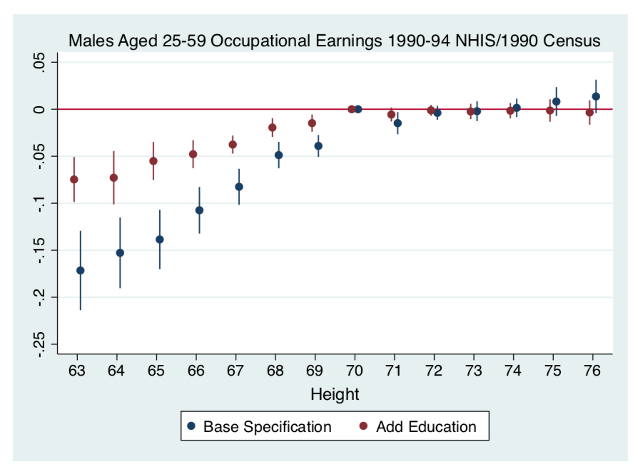
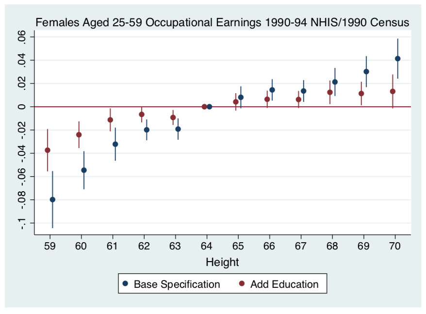
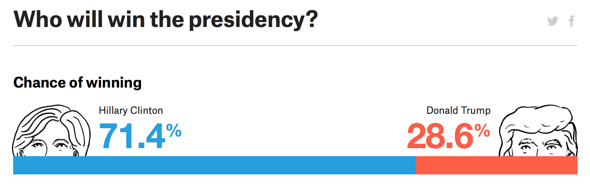
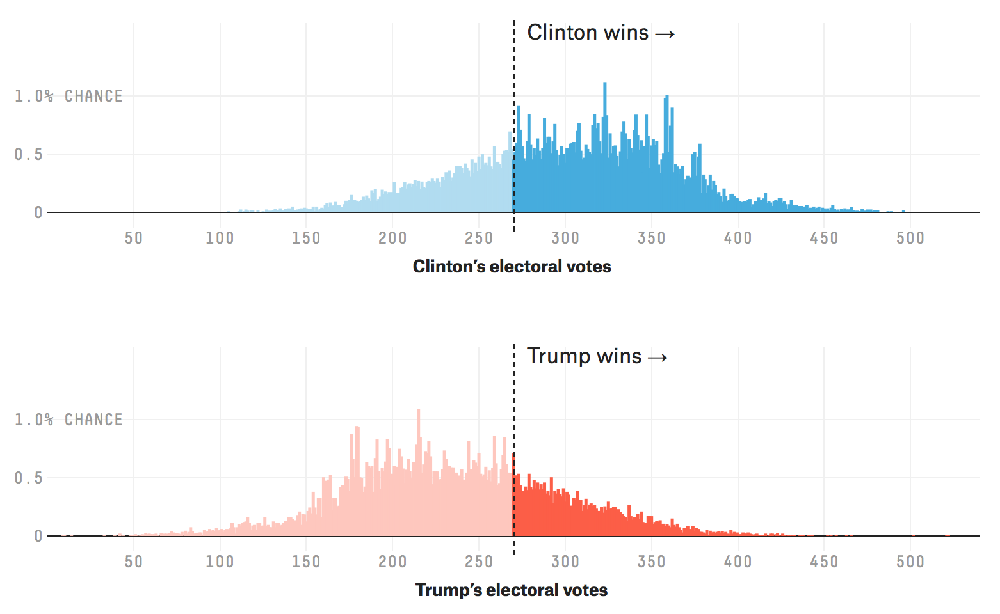
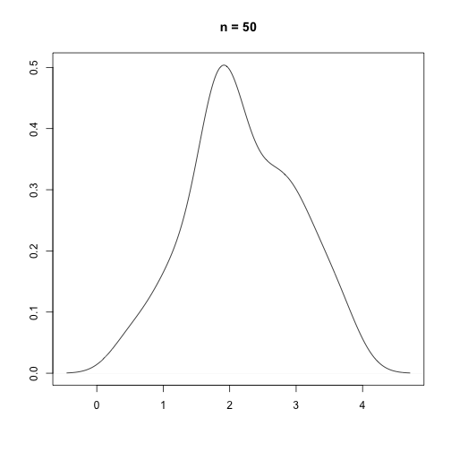
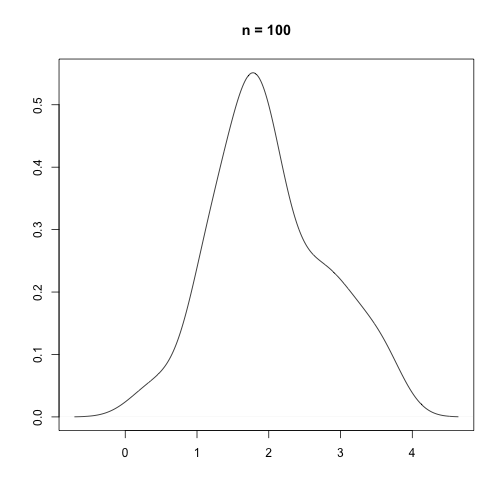
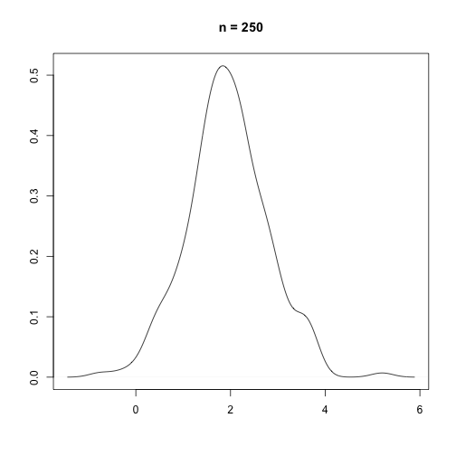
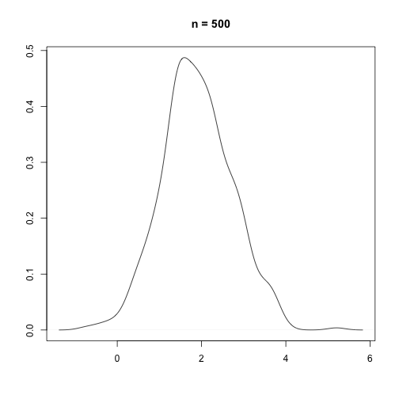
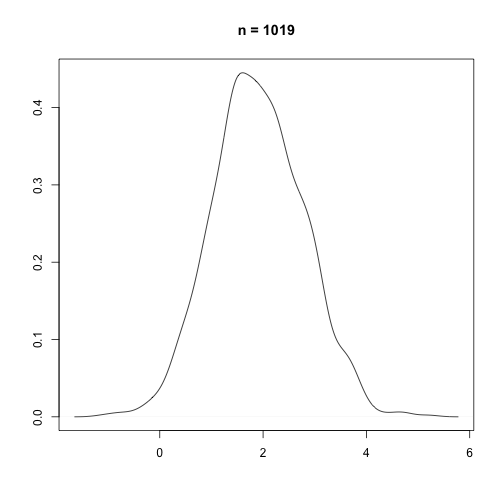

```{r, echo = FALSE, warning = FALSE, message = FALSE}
library(tidyverse)
library(pander)
cupid <- read.csv("https://raw.githubusercontent.com/mjclawrence/soci385/master/data/cupid.csv")

cupid <- mutate(cupid, height_z = (height - mean(cupid$height)) / sd(cupid$height))
```


# Warming Up

### When a variable is normally distributed, useful to know how far an observed value is from the mean in standardized units

--

### $\Large{z = \frac{x-\mu}{\sigma} = \frac{x - mean}{sd}}$

--

### Load the `cupid.csv` file as a data frame called `cupid`, load the usual packages, and find the z-score for your height (in inches).

--

```{r}
my_height_z <- 
      (71 - mean(cupid$height)) / sd(cupid$height)

my_height_z
```

---

# Height and Earnings



---

# Height and Earnings



---

# Warming Up

```{r, echo = FALSE, fig.width = 12, fig.height = 8}
height_density_plot <- ggplot(cupid, aes(x = height_z))
height_density_plot + geom_density() + geom_vline(xintercept = .68, color = "red") +
      theme(axis.title = element_text(size = 24), axis.text = element_text(size = 20)) 
```

---

# Warming Up

```{r, echo = FALSE, fig.width = 12, fig.height = 8}
height_z_density <- with(density(cupid$height_z), data.frame(x , y))
cumulative_density_plot <- ggplot(data = height_z_density, mapping = aes(x = x, y = y)) +
     geom_line() +
     geom_area(mapping = aes(x = ifelse(x <= .68, x, .68)), fill = "red") + ylim(c(0, .375)) +
      theme(axis.title = element_text(size = 24), axis.text = element_text(size = 20)) +
      labs(x = "height_z", y = "density")

cumulative_density_plot
```


---

# Warming Up

### Find the probability that someone in the sample will be shorter than you

--

```{r}
# Shorter = probability of a value to the left 
# of the distribution

pnorm(.68)
```

---

# Warming Up

```{r, echo = FALSE, warning = FALSE, fig.width = 12, fig.height = 8}
cumulative_density_plot + geom_text(x = -.1, y = .15, label = "75%", size = 8)
```

---

# Warming Up

### Find the probability that someone in the sample will be taller than you:

--

```{r}
# Taller = probability of a value to the right 
# of the distribution

1 - pnorm(.68)
```

---

# Warming Up

```{r, echo = FALSE, fig.width = 12, fig.height = 8}
cumulative_density_plot + 
     geom_text(x = -.1, y = .15, label = "75%", size = 8) +
     geom_area(data = height_z_density, aes(x = ifelse(x >=.68, x, .68)), fill = "forest green") +
     geom_text(x = 1.12, y = .15, label = "25%", size = 8)
```

---


# From Variables to Samples

--

### We have data from one sample of the population. But imagine taking many repeated samples of the population with replacement, each the same size as your sample.

--

### All those possible samples will make up the sampling distribution. Imagine each repeated sample as a random variable in a sampling distribution.

--

### Need some way to capture variation across repeated samples
- Each distribution of repeated samples has its own mean, proportions, variance, sd, etc

---


# What's the point?

--

### If the sample sizes in the sampling distribution are big enough, the mean across all the samples should be close to the population mean.

--

### The key bridge to inference is that we want to know how close the mean in our observed sample is to the true (unobserved) population mean. Knowing where it falls in the distribution of all the possible sample means is how we infer how similar the sample mean and the population are.

--

### Remember our new language: what is the probability of another randomly drawn sample mean being more extreme than our sample mean *simply by chance*

---

# Why Sampling Distributions Matter



---

# Why Sampling Distributions Matter



---


# Sampling Distributions

--

### Think of probability as "Long Run Frequency"
- The expected value after many repeated events

--

### Can look unexpected in small attempts/samples
- Chance of 6 heads in 6 coin tosses is very small: 1/64

--

### The more events, the expected patterns become clearer
- Would estimate 1 string of 6 heads every 64 tosses
- If you roll a die six times, probably will not get a 1, 2, 3, 4, 5, and 6. But if you roll a die 600 times, probably will get close to 100 of each.

---

# Measuring Sampling Variation

### Want to use sampling variation to know how representative sample statistic is of the population parameter

--

### Central Limit Theorem:
- As sample size increases, the mean of a variable across repeated samples *will* be normally distributed even if distribution of values in each sample is not normally distributed

---

# Measuring Sampling Variation

### In terms of z, as sample size increases, distribution of z-values of repeated sample means is normally distributed around standardized population mean of 0 with a standard deviation of 1

--

### Since the means from repeated samples are normally distributed, now it is not a problem if the distribution in one sample is not normally distributed!


---

# Sampling Means Normally Distributed As N Increases


---

# Sampling Means Normally Distributed As N Increases


---

# Sampling Means Normally Distributed As N Increases


---

# Sampling Means Normally Distributed As N Increases


---

# Sampling Means Normally Distributed As N Increases



---

# Measuring Sampling Variation

### Think back to survey sampling: when sample size is small, representativeness is lower; when n is big, the sample statistics are more representative of the true population parameters

--

### Two similar problems when we looked at distributions of values of one variable:
- The means from our repeated samples may deviate from the true population mean
- How big those deviations tend to be is based on the size of the sample

---

# Measuring Sampling Variation

### We won't pull repeated samples. But we'll use the *standard deviation* of our sample to calculate the *standard error* of the sampling distribution.

--

### $\Large{\sigma_{\bar{y}} = \frac{\sigma}{\sqrt{n}} = \frac{sd}{\sqrt{sample size}}}$

---


# An Example

### In the `cupid` data set, the age variable is *not* normally distributed, but we still want to use probability to estimate the population mean from our sample mean.

--

### Let's find the standard error of the age variable. We'll save this as an object, not as a new variable (since it is the same for the entire sample):

--

```{r}
age_se <- sd(cupid$age) / sqrt(length(cupid$age))

age_se
```

---

# From SE To Confidence Intervals

### We use the standard error, the sample mean and what we know about the distribution of z-scores to build a range of possible values for the population mean

--

### The most common range is a *95% confidence interval*
- That is the range in which the true population mean will be found in 95% of sampling distributions
- We are ***not*** saying we are 95% sure that our sample mean is the population mean!

---

# From SE To Confidence Intervals

### To build that 95% interval, we need to define a range that captures 95% of the normal distribution. In other words, outside this range there will be only a 2.5% chance that another sample will have a mean above our mean and a 2.5% chance that another sample will have a mean below our mean.

--

### That should sound like z-scores!

---

# From SE To Confidence Intervals

### We need the z-scores that are associated with .025 and .975. To find them, we use `qnorm()`.

--

```{r}
qnorm(.025)

qnorm(.975)
```

---

# Z-Scores For Confidence Intervals

## 95% (most common) = 1.96

## 99% = 2.58

## 90% (less common) = 1.65

---

# From SE To Confidence Intervals

### The z-score for the confidence interval we want multiplied by our standard error is the *margin of error*

--

```{r}
# Margin of Error:

1.96*age_se
```


---

# From SE To Confidence Intervals

### Our sample mean plus and minus the margin of error is our confidence interval

--

### Find both the *lower limit* and the *upper limit*

--

```{r}
# Lower Limit of Confidence Interval
age_ll <- mean(cupid$age) - 1.96*age_se

# Upper Limit of Confidence Interval
age_ul <- mean(cupid$age) + 1.96*age_se
```

---

# From SE To Confidence Intervals

### Often helpful to save the lower limit, mean, and upper limit as a vector

--

```{r}
age_ci <- c(age_ll, mean(cupid$age), age_ul)

age_ci
```

--

### Interpretation?
- 95% of the repeated samples we might imagine pulling would be expected to have means within this range, giving us 95% confidence that the true population mean falls within this range

---

# Exercise

## What is the 99% confidence interval for height?

### Find the standard error

### Find the margin of error

### Construct the confidence interval

---

# Exercise

```{r}
# Find the standard error:

height_se <- sd(cupid$height) / sqrt(length(cupid$height))
```

--

```{r}
# For the margin of error, we need .005 on each side of our mean:

qnorm(.995)
```

--

```{r}
# Margin of error =

2.58 * height_se
```

---

# Exercise

```{r}
# Construct the 99% Confidence Interval

height_ll <- mean(cupid$height) - 2.58*height_se
height_ul <- mean(cupid$height) + 2.58*height_se

height_ci <- c(height_ll, mean(cupid$height), height_ul)
```

--

```{r}
# Display

height_ci
```

--

### Interpretation?
