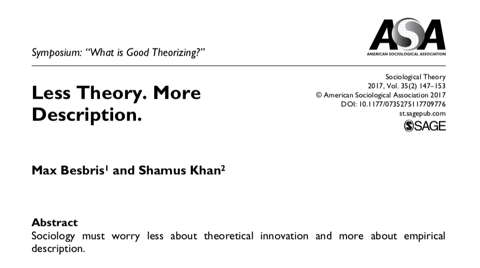

```{r setup, include=FALSE}
# Change css [here](/Users/lawrence/documents/github/soci385_f21/notes_slides/slides/metropolis.css)

options(htmltools.dir.version = FALSE)
library(xaringanthemer)
```

# Descriptive Statistics - Motivation

> ## "...[O]bservational research will continue to be the workhorse of social science, so we might as well get it right." (p. 228)

### Robert Sampson (2008): "Moving to Inequality"

---

# Descriptive Statistics - Motivation



---

# Descriptive Statistics - Motivation

> ### "We need to understand the world better. It is not foolish to imagine we need more concepts to help classify our understanding. Yet somewhat counterintuitively, we need the exact opposite...

---

# Descriptive Statistics - Motivation

> ### "...What we need are findings. We need editors who are willing to publish descriptively rich, findings-driven papers; reviewers who are happy to support findings that are rigorously generated; and a discipline that realizes the development of theory happens not when concepts are highly cited but instead when they are clearly specified. Less theory. More description."
- Besbris and Khan (2017: 152)

---

# Descriptive Statistics - Motivation

### Sen (1980): "Description as Choice":

> ### "Description isn't just observing and reporting; it involves the exercise - possibly difficult - of selection." (p. 353)

--

> ### "[Description] can be usefully seen as a choice of a subset of a possible statements." (p. 367)

---

# Choices by Chetty et al (2017)?

--

### Defining *access* by enrolled students rather than applicants or admits

### Grouping students by birth cohort rather than year of entry

### Only describing distributions for 1991 cohort

### Comparing quintiles and percentiles, combining quintiles

### Describing family income rather than wealth

---

# Types of Descriptive Statistics

--

### Frequencies = counts of values

--

### Percent = Count of values for every 100 cases
- Bounded by 0 and 100, like 78%

--

### Proportion = Percent / 100
- Bounded by 0 and 1, like .78

--

### Ratio = frequency of 1 value per count of another value
- For ratio of SOCI majors to non-SOCI majors in this class, divide count of SOCI majors by count of non-SOCI majors

---

# Types of Descriptive Statistics

### Range = minimum and maximum values
- Often listed within brackets: [0, 100]

--

### Mode: The value with the highest frequency

---

# Describing The Center

--

### Mean: Average or "Expected Value"

--

$\Large{\bar{x} = \frac{\sum x_i}{n}}$ 

--

- Best guess if you don't know anything else...

--

### Median: 50% of values fall above, 50% of values fall below

--

### Can take mean, median, and mode of quantitative variables

--

### Can describe the frequency, percent, proportion, and mode in a given category. But the mean and median of a categorical variable do not make sense (except for binary or dummy variables).

---

# Describing The Spread

--

### Helpful to know how far from the center the observations are distributed

--

### Start by thinking of the center not as a point but as a range
- The *interquartile range* (IQR) is the middle 50%
- Bounded by the 25th percentile and 75th percentile
- But other percentiles might also be helpful (quintiles, top 1%, etc)

--

### *More on variance, standard deviations, and skew next week*