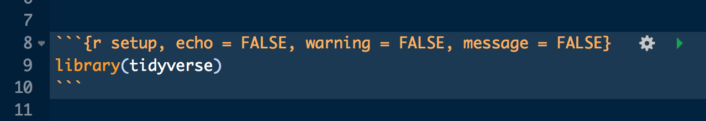
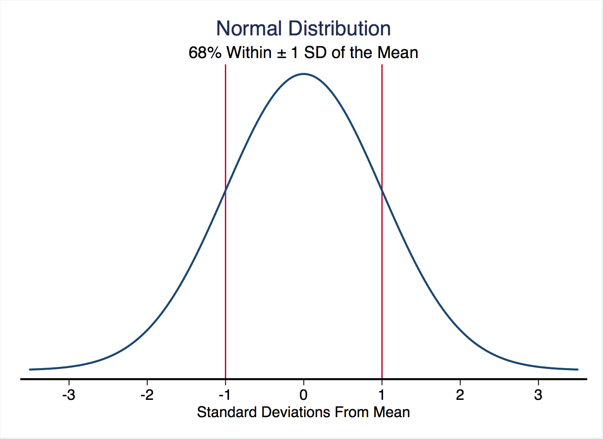
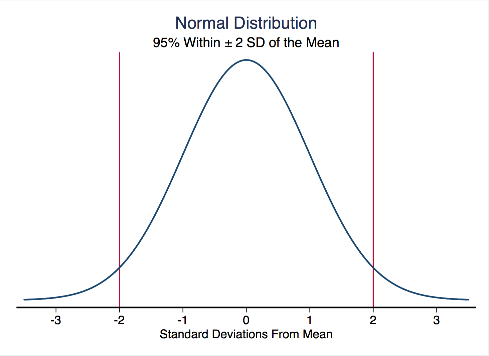
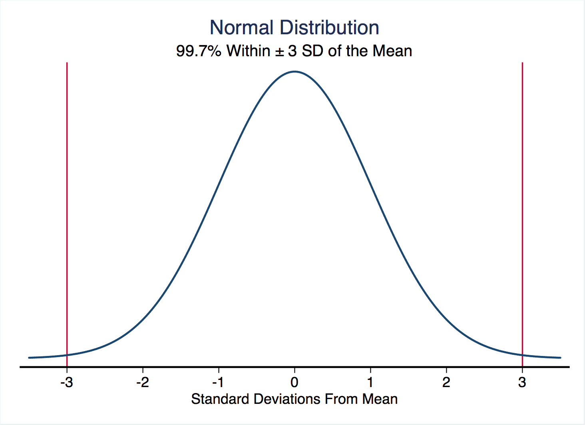
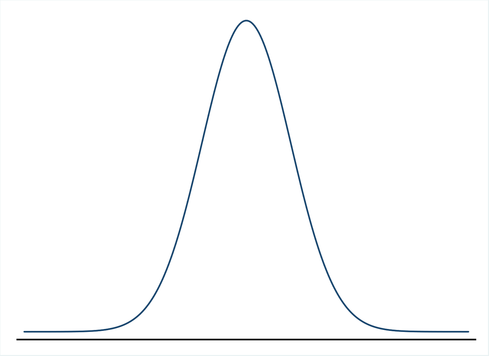
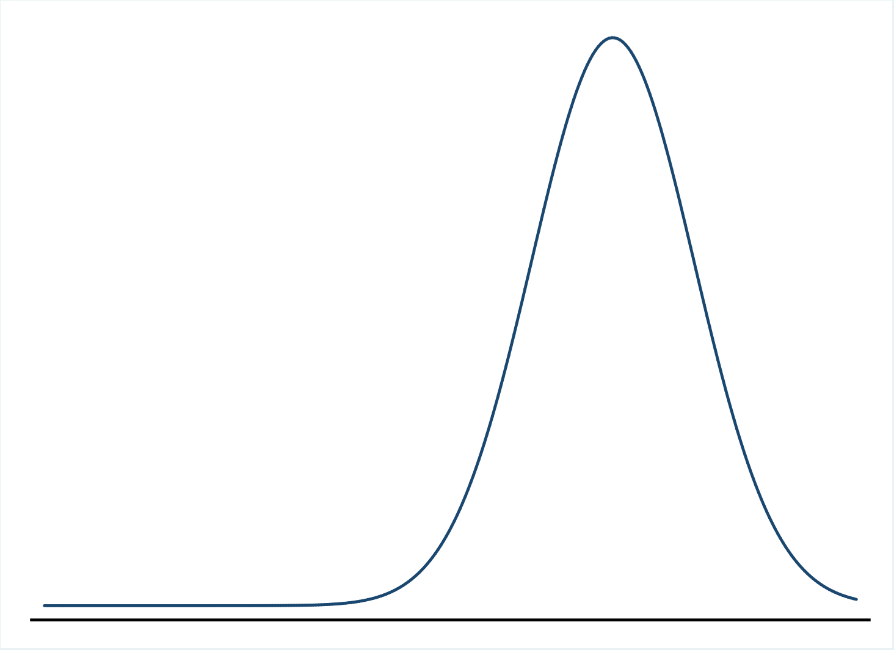
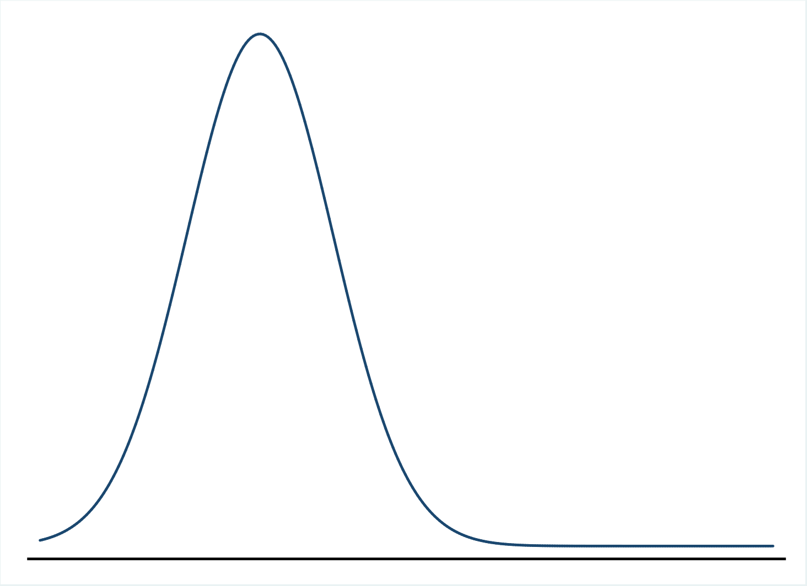

```{r, include = FALSE}
assignment2 <- read.csv("https://raw.githubusercontent.com/mjclawrence/soci385_f21/master/data/assignment_02.csv")
```

# Assignment 2 General Thoughts

--

### Include your Rmd file if you email me with questions

--


### Remember to add your name and date to the header

--

### Knit or Preview as you go so it's easier to identify where problems are

--

### Load packages when you load your data. And when loading tidyverse, do not include echoes, warnings, and messages



--

### Review in-class notebooks before starting

---

# Assignment 2 Recap

### 1. What are the mean and median of `agekdbrn`?

--

```{r}
summary(assignment2$agekdbrn)
```

--

### This also works...

```{r}
mean(assignment2$agekdbrn)

median(assignment2$agekdbrn)
```

---

# Assignment 2 Recap

### 2. Find the difference between 25th percentile and 75th percentile:

--

```{r}
pctle75 <- 28    # Don't use quotation marks!
pctle25 <- 20    # Or parentheses! Or curly brackets!
pctle75 - pctle25
```

---

# Quick Detour

### IQR matters for definition of outliers

--

### High outliers are values that are at least 1.5 times the IQR above the 75th percentile

--

```{r}
pctle75 + 1.5*(pctle75 - pctle25) # cutoff for high outliers
```

--

### Low outliers are values that are at least 1.5 times the IQR below the 25th percentile

--

```{r}
pctle25 - 1.5*(pctle75 - pctle25) # cutoff for low outliers
```

---

# Assignment 2 Recap

### 3. What is the mode of `agekdbrn` for respondents who completed 12 or fewer years of education?

--

```{r, eval = FALSE}
table(assignment2$agekdbrn
      [assignment2$educ<=12])
```

--

```{r, echo = FALSE}
table(assignment2$agekdbrn
      [assignment2$educ<=12])
```

---

# Assignment 2 Recap

### Want to sort?

--

```{r}
sort(table(assignment2$agekdbrn
      [assignment2$educ<=12]), decreasing = TRUE)
```


---

# Assignment 2 Recap

### 4. What proportion of respondents completed exactly 16 years of education?

--

```{r}
prop.table(table(assignment2$educ))
```

--

### *Want to round?*

--

```{r}
round(prop.table(table(assignment2$educ)),3) # 3 for 3 decimal places
```

---

# Assignment 2 Recap

### 5. Use `dplyr` to create a new data frame with only the `agekdbrn` and `educ` variables, and that is limited to respondents who have 16 or more years of education.

--

```{r, echo = FALSE, warning = FALSE, message = FALSE}
library(tidyverse)  # dplyr loads with tidyverse!
```

```{r, eval = FALSE, warning = FALSE, message = FALSE}
library(tidyverse)  # dplyr loads with tidyverse!
```

--

### *A Couple Options...*

--

```{r, eval = FALSE}
assignment2_q5a <- select(assignment2, agekdbrn, educ) # DF name but no $
assignment2_q5a <- filter(assignment2_q5a, educ>=16)
```

--

```{r, eval = FALSE}
assignment2_q5b <- assignment2 |> # With pipe, need DF name in first line
     select(agekdbrn, educ) |> # But omit DF name from subsequent lines
     filter(educ>=16)
```

---

# Assignment 2 Recap

### 6. What are the mean and median of `agekdbrn` for respondents in this new data frame?

```{r}
assignment2_q5b <- assignment2 |>
     select(agekdbrn, educ) |>
     filter(educ>=16) # No quotation marks

summary(assignment2_q5b$agekdbrn)
```

---

# Assignment 2 Recap

### 7. How long did the assignment take?

--

```{r, echo = FALSE}
time <- c(1.5, 3, 1.5, .67, 2, 2.5, 1.25, 2, 3, 3, 2)
```

```{r}
summary(time)
```

---

# Center, Spread, Shape

--

### Range gives us the *minimum* and the *maximum* values

--

### Mean and median give us the *center* of the distribution

--

### Mode gives us the *most frequent* value

--

### Also want information about the *spread* of distributions

--

- Variance

--

- Standard Deviation

--

- Skewness

---

# Spread

### Variance = how we measure *spread* but it has no common scale

--

### Standard Deviation = measure of how far observations tend to be from the mean

--

### Standard Deviation is the square root of the variance

--

$\Large{s = \sqrt{\frac{\sum (y_i - \bar{y})^2}{n}}}$

--

### How do we find the variance and standard deviation in R?

---

# Loading Files

### We'll use the `gss_week3.csv` file on Canvas. Download this file, save it, and load it in `notebook_03_01.Rmd`.

```{r, eval = FALSE}
gss_week3 <- read.csv('data/gss_week3.csv')
```

```{r, echo = FALSE}
gss_week3 <- read.csv("data/gss_week3.csv")
```


---

# Describing Spread

### Start with a summary of the `agekdbrn` variable

--

```{r}
summary(gss_week3$agekdbrn)
```

--

### For variance, use `var()`:

```{r}
var(gss_week3$agekdbrn)
```

--

### For standard deviation, use `sd()`:

```{r}
sd(gss_week3$agekdbrn)
```

---

# Describing Spread

### We can show that the standard deviation is the square root of the variance:

--

```{r}
var(gss_week3$agekdbrn) # Variance
```

```{r}
sqrt(var(gss_week3$agekdbrn)) # Square Root of Variance
```

```{r}
sd(gss_week3$agekdbrn) # Standard Deviation
```

```{r}
sd(gss_week3$agekdbrn) ^ 2 # Standard Deviation Squared
```


---

# Describing Spread

### Would you expect more or less variation in the distribution of completed years of education (the `educ` variable)?

--

```{r}
var(gss_week3$educ)
sd(gss_week3$educ)
```


---

# Describing The Shape of the Spread

### For now, keep in mind that the shape we like the most is a *normal distribution* (or bell curve)

---

# The Normal Distribution

```{r, echo = FALSE}
knitr::include_graphics("385_figures/normal.png")
```

---

# The Normal Distribution

```{r, echo = FALSE, out.height = "85%", out.width = "85%"}

```

---

# The Normal Distribution

```{r, echo = FALSE, out.height = "85%", out.width = "85%"}

```

---

# The Normal Distribution

```{r, echo = FALSE, out.height = "85%", out.width = "85%"}

```

---

# Describing The Shape of the Spread

### But values are often not normally distributed

--

### The measure of `skewness` tells us where the "long tail" extends

--

- Right skewed distributions extend to higher distributions

--

- Left skewed distributions extend to lower distributions

---

# Describing Shape - Normal Distribution

```{r, echo = FALSE, out.height = "85%", out.width = "85%"}

```

---

# Describing Shape - Left Skew

```{r, echo = FALSE, out.height = "85%", out.width = "85%"}

```

---

# Describing Shape - Right Skew

```{r, echo = FALSE, out.height = "85%", out.width = "85%"}

```

---

# Income Is Often Right Skewed

```{r, echo = FALSE}
colleges <- read.csv("https://raw.githubusercontent.com/mjclawrence/soci385/master/data/college_mobility.csv")
```

```{r, echo = FALSE, fig.height=8, fig.width = 12}
plot1 <- ggplot(colleges, aes(x = par_median))
plot1 + geom_density(size = 4) + scale_x_continuous(labels = scales::dollar) +
     theme(axis.text.x = element_text(size = 24),
           axis.text.y = element_blank(),
           axis.title = element_text(size = 24),
           title = element_text(size = 24)) +
     labs(x = "Median Parent Income", y = "Density",
          title = "Median Parent Income at US Colleges and Universities",
          subtitle = "Opportunity Insights Data") 
```


---

# Median Not Centered

```{r, echo = FALSE, fig.height=8, fig.width = 12}
plot2 <- ggplot(colleges, aes(x = par_median))
plot2 + geom_density(size = 4) + scale_x_continuous(labels = scales::dollar) +
     theme(axis.text.x = element_text(size = 24),
           axis.text.y = element_blank(),
           axis.title = element_text(size = 24),
           title = element_text(size = 24)) +
     labs(x = "Median Parent Income", y = "Density",
          title = "Median Parent Income at US Colleges and Universities",
          subtitle = "Opportunity Insights Data") +
     geom_vline(xintercept = median(colleges$par_median), 
                color = "Forest Green", size = 3)
```
---

# Mean Pulls To Tail

```{r, echo = FALSE, fig.height=8, fig.width = 12}
plot3 <- ggplot(colleges, aes(x = par_median))
plot3 + geom_density(size = 4) + scale_x_continuous(labels = scales::dollar) +
     theme(axis.text.x = element_text(size = 24),
           axis.text.y = element_blank(),
           axis.title = element_text(size = 24),
           title = element_text(size = 24)) +
     labs(x = "Median Parent Income", y = "Density",
          title = "Median Parent Income at US Colleges and Universities",
          subtitle = "Opportunity Insights Data") +
     geom_vline(xintercept = median(colleges$par_median), 
                color = "Forest Green", size = 3) +
     geom_vline(xintercept = mean(colleges$par_median),
                color = "Red", size = 3) 
```

---

# And Pulls To Highest Values

```{r, echo = FALSE, fig.height=8, fig.width = 12}
plot4 <- ggplot(colleges, aes(x = par_median))
plot4 + geom_density(size = 4) + scale_x_continuous(labels = scales::dollar) +
     theme(axis.text.x = element_text(size = 24),
           axis.text.y = element_blank(),
           axis.title = element_text(size = 24),
           title = element_text(size = 24)) +
     labs(x = "Median Parent Income", y = "Density",
          title = "Median Parent Income at US Colleges and Universities",
          subtitle = "Opportunity Insights Data") +
     geom_vline(xintercept = median(colleges$par_median), 
                color = "Forest Green", size = 3) +
     geom_vline(xintercept = mean(colleges$par_median),
                color = "Red", size = 3) +
     geom_vline(xintercept = colleges$par_median[
          colleges$name=="Middlebury College"],
          color = "Blue", size = 3) +
     geom_text(x = 180000, y = 9.8035e-06, 
               label = "Middlebury has the 6th \nhighest median parent income \n ($244,300)", size = 9, color = "Blue")
```

---

# Transforming Skewed Distributions

```{r, echo = FALSE, fig.height=8, fig.width = 12}
plot5 <- ggplot(colleges, aes(x = log(par_median)))
plot5 + geom_density(size = 4) +
     theme(axis.text.x = element_text(size = 24),
           axis.text.y = element_blank(),
           axis.title = element_text(size = 24),
           title = element_text(size = 24)) +
     labs(x = "Log of Median Parent Income", y = "Density",
          title = "Logged Median Parent Income at US Colleges and Universities",
          subtitle = "Opportunity Insights Data") +
     geom_vline(xintercept = median(log(colleges$par_median)), 
                color = "Forest Green", size = 3) +
     geom_vline(xintercept = mean(log(colleges$par_median)),
                color = "Forest Green", size = 3) +
     geom_vline(xintercept = log(colleges$par_median[
          colleges$name == "Middlebury College"]),
          color = "Blue", size = 3)
```
