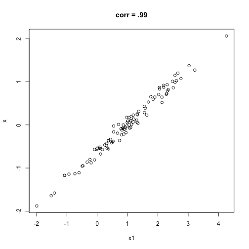
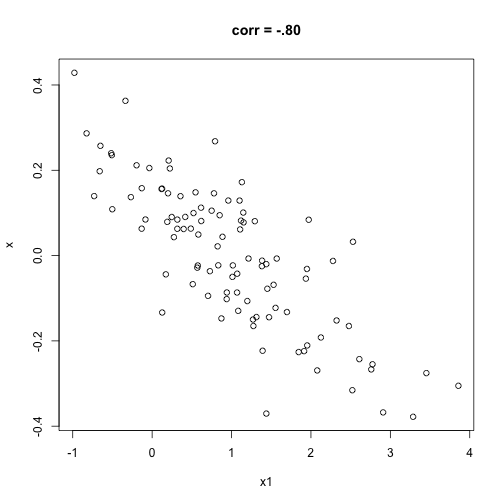

```{r setup, include=FALSE}
# Change css [here](notes_slides/slides/metropolis.css)

options(htmltools.dir.version = FALSE)
library(xaringanthemer)
library(flair)
```


```{r, include = FALSE}
assignment_3 <- read.csv("https://raw.githubusercontent.com/mjclawrence/soci385_f21/main/data/assignment_03.csv")
library(tidyverse)
library(kableExtra)
```


# Assignment 3 Recap - Question 1

## Create a histogram showing the distribution of the `hrs1` variable.

--

```{r, eval = FALSE, error = FALSE, message = FALSE, warning = FALSE}
hours_histogram <- ggplot(assignment_3, aes(x = hrs1))

hours_histogram + geom_histogram() +
  labs(x = "Hours Worked", y = "Number of Observations",
       title = "Distribution of Hours Worked", 
       subtitle = "GSS, 2008-2018")
```


---

# Assignment 3 Recap - Question 1

```{r, echo = FALSE, error = FALSE, message = FALSE, warning = FALSE, fig.height=8, fig.width = 12}
hours_histogram <- ggplot(assignment_3, aes(x = hrs1))

hours_histogram + geom_histogram() +
  labs(x = "Hours Worked", y = "Number of Observations",
       title = "Distribution of Hours Worked", 
       subtitle = "GSS, 2008-2018") +
     theme(axis.text.x = element_text(size = 24),
           axis.text.y = element_text(size = 24),
           axis.title = element_text(size = 24),
           title = element_text(size = 24))
```

---

# Assignment 3 Recap - Question 2

## Create a figure with overlapping density plots for each social class.

--

```{r, eval = FALSE}
assignment_3 <- assignment_3 |> 
  mutate(class = factor(class, 
          levels = c("Lower", "Working", "Middle", "Upper")))

hours_class_plot <- ggplot(assignment_3, 
  aes(x = hrs1, color = class))

hours_class_plot + geom_density() + 
     labs(x = "Hours Worked", y = "Density",
          title = "Distribution of Hours Worked by Class",
          subtitle = "GSS, 2008-2018",
          color = "Class")
```

---

# Assignment 3 Recap - Question 2

```{r, echo = FALSE, fig.height=8, fig.width = 12}
assignment_3 <- assignment_3 |> 
  mutate(class = factor(class, 
  levels = c("Lower", "Working", "Middle", "Upper")))

hours_class_plot <- ggplot(assignment_3, 
  aes(x = hrs1, color = class))

hours_class_plot + geom_density() + 
     labs(x = "Hours Worked", y = "Density",
          title = "Distribution of Hours Worked by Class",
          subtitle = "GSS, 2008-2018",
          color = "Class") +
     theme(axis.text = element_text(size = 24),
           axis.title = element_text(size = 24),
           title = element_text(size = 24),
           legend.text = element_text(size = 20))
```


---


# Assignment 3 Recap - Question 3

## Create a new factor variable for hours worked with the following categories: less than 20, 20-39, 40, more than 40. The levels should be in order from least to most hours.

--

```{r}
assignment_3 <- assignment_3 |> 
     mutate(hours_cat = ifelse(hrs1<20, "Less Than 20",
                               ifelse(hrs1 %in% 20:39, "20-39",
                                      ifelse(hrs1==40, "40",
                                             "More Than 40"))),
            hours_cat = factor(hours_cat,
               levels = c("Less Than 20", "20-39", "40", "More Than 40")))
```


---


# Assignment 3 Recap - Question 4

## Create a table showing the proportion of respondents in each region who are in each category of hours worked. Which region has the highest proportion of respondents who work more than forty hours a week?

--

```{r, eval = FALSE}
round(prop.table(table(assignment_3$region, 
                       assignment_3$hours_cat),1),3) # 1 for row proportions!
```

---

# Assignment 3 Recap - Question 4

```{r, echo = FALSE}

kbl(
  round(prop.table(table(assignment_3$region, 
                       assignment_3$hours_cat),1),3),
  align=rep('c', 4)) |> 
  kable_paper("hover")

```

---

# Introducing Kable!


---

# Introducing Kable!

### Install and load package

```{r, eval = FALSE}
install.packages("kableExtra") # Only the first time
library(kableExtra)
```

--

### Wrap the table in `kbl()`

```{r, eval = FALSE}
kbl(round(prop.table(
     table(assignment_3$region, 
                       assignment_3$hours_cat),1),3),
    booktabs = TRUE, # For basic formatting
    align=rep('c', 4)) # For *center* alignment in the *4* columns
```

---

# Assignment 3 Recap - Question 5

## Use `dplyr`'s `group_by()` and `summarize()` functions to find the standard deviation of hours worked by race/ethnicity.

--

```{r, eval = FALSE}

sd_hours_race <- assignment_3 |> 
  group_by(racehisp) |> # Want info for each level of this variable
  summarize(sd_hours = round(sd(hrs1),3)) # Info we want

colnames(sd_hours_race) <- # For changing the table's "column names"
  c("Race/Hisp", "Std Dev Hours") 
```

---

# Assignment 3 Recap - Question 5

```{r, echo = FALSE, error = FALSE, warning = FALSE, message = FALSE}
sd_hours_race <- assignment_3 |> 
  group_by(racehisp) |> 
  summarize(sd_hours = round(sd(hrs1),1))
colnames(sd_hours_race) <- c("Race/Hisp", "Std Dev Hours")

kbl(sd_hours_race,
    align=rep('c', 2)) |> 
  kable_paper("hover")

colnames(sd_hours_race) <- c("racehisp", "sd_hours")
```

---

# Assignment 3 Recap - Optional Figure

```{r optional_figure, echo = FALSE, fig.height=8, fig.width = 12}
sd_plot <- ggplot(sd_hours_race, 
                          aes(x = racehisp, y = sd_hours,
                              fill = racehisp))

sd_plot + geom_col() + 
     geom_text(aes(label = sd_hours, vjust="outward"), size = 10) +
     labs(x = "", y = "Standard Deviation",
          title = "Standard Deviation in Hours Worked",
          subtitle = "General Social Survey, 2008-2018") +
     guides(fill = "none") +
     theme(axis.text = element_text(size = 24),
           axis.title = element_text(size = 24),
           title = element_text(size = 24),
           legend.text = element_text(size = 20))
```

---

# Assignment 3 Recap - Optional Figure

```{r, eval = FALSE}
sd_plot <- ggplot(sd_hours_race, 
                          aes(x = racehisp, y = sd_hours,
                              fill = racehisp))

sd_plot + 
  geom_col() + # Use geom_col when you have x and y
  geom_text(aes(label = sd_hours, 
                vjust="outward"), # Easier than specifying values
            size = 10) +
  labs(x = "", y = "Standard Deviation",
       title = "Standard Deviation in Hours Worked",
       subtitle = "General Social Survey, 2008-2018") +
  guides(fill = "none") +
  theme(axis.text = element_text(size = 24), # Similar to strip.text.y
        axis.title = element_text(size = 24),
        title = element_text(size = 24),
        legend.text = element_text(size = 20))
```

---

# Measures of Association

### Last week: Describing two categorical variables

--

### This week: Describing relationship between two numerical variables

--

### Remember a hypothesis: How variables *tend to move together*

--

- How close or tight are the values? How well do they resemble a straight line?

--

- The spread they tend to share = covariance

--

- The change they tend to share = correlation

---

# Interpreting Correlations

### Easier to interpret correlations than covariances

--

- Always bounded by -1, 1

--

- Association is linear (for now)

--

- Positive correlation > 0

--

     - When X is larger than its mean, likely that Y is larger than its mean

--

- Negative correlation < 0

--

     - When X is larger than its mean, unlikely that Y is larger than its mean

---

# Interpreting Correlations 

### Correlation of X, Y = Correlation of Y, X

--

- But still think of axes

--

### Not affected by changes in scale

--

- Can multiply all the values by a constant and the correlation is still the same
- Temperature degrees, currencies, etc. 

--

### But can be affected by outliers

---

# Strength of Association

### Positive correlation coefficients look like proportions but they are not

--

### Strong association: knowing a value of one variable helps predict a value of the other variable

--

### Weak association: too much variability to use the value of one variable to make a good guess about the value of the other variable 

--

### Remember: Not causal!

--

### Keep in mind: *strong* is not always *better*

---

# Strength of Associations

### No association = 0 to .19 or 0 to -.19

### Weak association = .20 to .29 or -.20 to -.29

### Moderate association = .30 to .49 or -.30 to -.49

### Strong association = .50 to .69 or -.50 to -.69

### Very strong association = greater than .70 or less than -.70

---
class: middle, center

# Scatterplots


---
class: middle, center

# Scatterplots


---
class: middle, center

# Scatterplots


---
class: middle, center

# Scatterplots


---
class: middle, center

# Scatterplots



---
class: middle, center

# Scatterplots


---
class: middle, center

# Scatterplots



---
class: middle, center

# Scatterplots


---
class: middle, center

# Scatterplots


---
class: middle, center

# Scatterplots


---

# An Example: Chetty et al (2014)

### Comparing income mobility rates across regions

--

### Regional variation across 741 "Commuting Zones"
- Cover all counties (not just metropolitan statistical areas)
- We are in the Burlington, VT commuting zone

--

### Tax data from parents of 6.3 million children born in 1980-1
- Identify CZ and parent's income when child was age 16
- Compare to child's income around age 30

--

### "Mobility" = the average income rank in the children's income distribution for children who grew up at the 25th percentile in the parent's income distribution

---

# An Example: Chetty et al (2014)


---

# Explaining Regional Variation

--

### Three-quarters of variance in absolute upward mobility explained by five factors:

--

- Gini coefficient for bottom 99%

--

- Social capital index (voter turnout, community participation, returning census forms, etc.)

--

- Proportion of children living in single-parent households

--

- High school dropout rate adjusted for family income

--

- Proportion of workers who commute 15 minutes or less

--

### Let's explore using the `notebook_04_01` file on Canvas