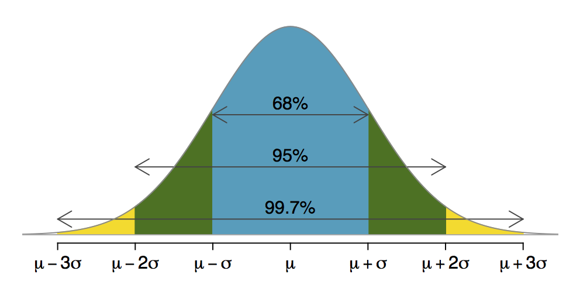

```{r setup, include=FALSE}
# Change css [here](/notes_slides/slides/metropolis.css)

options(htmltools.dir.version = FALSE)
library(xaringanthemer)
```

# Thinking Probabilistically

### So far: Summarizing observed values of variables
- Descriptions about the centers and shapes of distributions

--

### Now: Estimating probability of observing value in the sample
- Or, quantifying chance that a value is different from what is observed

--

### Up next: Inference
- What is the probability that a sample statistic is different from a population parameter?

---

# Thinking Probabilistically

### Using what we observe in our sample to estimate what we want to know about the population
- The population value exists but we don't observe it. We'll use what we do know to estimate the range of possible values for the population measure.

--

### From describing precision...
- 25% of commuting zones spend more than the national average on school expenditures

--

### To quantifying likelihood...
- 2.5% chance that a commuting zone we randomly pull from the data set will spend more than Addison County does on school expenditures

---

### For now, assume variable is normally distributed, and apply what we know about means and standard deviations in normal distributions...

---


# Normal Distribution



---

# Probability Distributions

### Strategy is to find a value's distance from the mean in standard deviations. This measure is called the `z-score`.

--

### $\Large{z = \frac{x - \mu}{\sigma}}$

--

### Positive z-score is a value's distance above the mean in standard deviations

### Negative z-score is a value's distance below the mean in standard deviations

--

