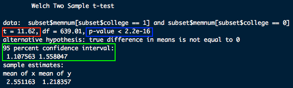
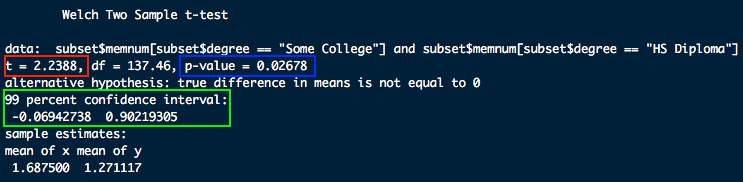

```{r setup, include=FALSE}
# Change css [here](/notes_slides/slides/metropolis.css)

options(htmltools.dir.version = FALSE)
library(xaringanthemer)
```

# Assignment 5 Review - Question 1

```{r, echo = FALSE, message = FALSE}
library(tidyverse)
assignment_05 <- read.csv("https://raw.githubusercontent.com/mjclawrence/soci385_f21/main/data/assignment_05.csv")

week_8_1 <- read.csv("https://raw.githubusercontent.com/mjclawrence/soci385_f21/main/data/week_8_1.csv")
```


### Does the mean number of days of poor mental health differ from 3 at the 99% confidence level?

--

```{r, eval = FALSE}
t.test(assignment_05$mntlhlth, mu = 3, conf.level = .99)
```

---

# Question 1

--

```{r, echo = FALSE}
t.test(assignment_05$mntlhlth, mu = 3, conf.level = .99)
```

```{r}
# Find cutoff for t-stat
qt(.995, df = 1288)
```


---

# Question 1

### Cannot reject the null hypothesis at 99% confidence level
- t-stat is not more extreme than 2.58
- p-value is not less than .01
- confidence interval includes mu value of 3

---

# Question 2

### Among respondents reporting any days of poor mental health, does the mean number of days differ from 7 at the 95% confidence level?

--

```{r, eval = FALSE}
t.test(assignment_05$mntlhlth[assignment_05$mntlhlth>0],
       mu = 7, 
       conf.level = .95) # could delete; it's the default
```

---

# Question 2

```{r, echo = FALSE}
t.test(assignment_05$mntlhlth[assignment_05$mntlhlth>0],
       mu = 7, 
       conf.level = .95)
```

```{r}
# Find cutoff for t-stat
qt(.975, df = 554)
```

---

# Question 2

### Can reject the null hypothesis at 95% confidence level
- t-stat is more extreme than 1.96
- p-value is less than .05
- confidence interval does not include mu value of 7
        
---

# Question 3

### Consider respondents who have not entered or completed college. Among these respondents, does the proportion with any mental health days differ from .10 at the 99% confidence level?

```{r}
# Set up binary variables

assignment_05 <- assignment_05 |> 
  mutate(college_degree = 
           ifelse(str_detect(degree, "degree"), 1, 0),
         any_days = 
           ifelse(mntlhlth>0, 1, 0))
```

---

# Question 3

```{r}
# Get frequencies

addmargins(table(assignment_05$college_degree,
                 assignment_05$any_days))
```

--

```{r, eval = FALSE}
# Feed frequencies to prop.test

prop.test(342, 810, p = .10, conf.level = .99)
```


---

# Question 3

```{r, echo = FALSE}
prop.test(342, 810, p = .10, conf.level = .99)
```

--

### Reject the null hypothesis
- p value is less than .01
- confidence interval does not include p of .10

---

# Question 4

### Consider respondents who have completed college or more. Among these respondents, does the proportion with any mental health days differ from .10 at the 95% confidence level?

--

```{r}
# Get frequencies

addmargins(table(assignment_05$college_degree,
                 assignment_05$any_days))
```

```{r, eval = FALSE}
# Feed frequencies to prop.test

prop.test(213, 479, p = .10, conf.level = .95)
```

---

# Question 4

```{r, echo = FALSE}
# Feed frequencies to prop.test

prop.test(213, 479, p = .10, conf.level = .95)
```

--

### Reject the null hypothesis
- p value is less than .05
- confidence interval does not include p of .10

---

# Comparing Samples

### Assignment questions measured the difference between an estimated mean and a null hypothesis value in terms of standard errors

--

### This week, we will measure the difference between two estimated means, and then measure that distance from a null hypothesis value in terms of standard errors

---

# Comparing Samples

### Basics are the same: we need means, standard errors, and null hypotheses but we estimate them slightly differently

--

### Assumptions are also the same
- Distribution of differences between means is normally distributed
- For large sample sizes, t-distribution still approximates z-distribution

---

# Comparing Samples

--

### Significance tests define groups (not datasets) as *samples*

--

### Samples are *independent* if the observations are random
- Coin flips are independent of each other.
- Across years, cross-sectional surveys (like GSS) are independent

--

### Samples are *dependent* if observations are matched
- Can be the same observations in a long-term panel (PSID, NLSY, etc.) or multiple measures in a short-term study (scores from two exams)
- Can be different observations if respondents' answers could be correlated (partners, siblings, etc.)

---

# CIs for Comparing Means

### From CI for mean to CI for difference in means

--

### CI formula for difference in means is similar to what we used for means: 
$CI = (\bar{y}_2 - \bar{y}_1) \pm t(se)$

--

### SE is still the first step, but now want SE *of the difference*:
$se = \sqrt{ \frac{s_1^2}{n_1} + \frac{s_2^2}{n_2}}$

--

### When coding, easier to replace numerators with variances:
$se = \sqrt{ \frac{var_1}{n_1} + \frac{var_2}{n_2}}$

---

# CIs for Comparing Means

### Example using `week_8_1` data. We want a new data frame called `subset` that only has observations with non-missing values for the `memnum` variable:

--

```{r}
subset <- filter(week_8_1, !is.na(memnum))
```

--

### We want to compare mean memberships across two degree categories. Options?

---

# CIs for Comparing Means

### Could use binary variables or indexing. For this example, create a binary variable called `college` where everyone with at least a college degree gets a 1 and everyone else gets a 0.

---

# CIs for Comparing Means

### What values of `degree` should we distinguish?

--

```{r}
table(subset$degree)
```

--

```{r}
# Create binary variable
subset <- mutate(subset, college = 
                      ifelse(str_detect(degree, 
                                        "Degree"), 1, 0))
```

---

# CIs for Comparing Means

### For the standard error formula, we'll need the number of respondents in each category of `college`:

--

```{r}
table(subset$college)
```

# CIs for Comparing Means

### We need the mean number of memberships for college degree holders and non college degree holders

--

```{r}
mean(subset$memnum[subset$college==0])
mean(subset$memnum[subset$college==1])
```

---

# CIs for Comparing Means

```{r}
# This also works

means <- subset |> 
     group_by(college) |> 
     summarize(mean_memnum = mean(memnum, na.rm = TRUE))

means
```

---

# CIs for Comparing Means

### We want to know if the difference between these two means is significant

--

### In the language of hypothesis testing, we want to know if we can reject the null hypothesis that the true difference between these two sample means is zero

--

### Start with the difference:

--

```{r}
diff <- 2.551163 - 1.218357
diff
```

---

# CIs for Comparing Means

### Then find the standard error of the difference:

$se = \sqrt{ \frac{var_{memnum,college=0}}{n_{college=0}} + \frac{var_{memnum,college=1}}{n_{college=1}} }$

--

```{r}
diffse_college0 <- var(subset$memnum[subset$college==0]) / 
                              1035

diffse_college1 <- var(subset$memnum[subset$college==1]) / 
                              430

diffse <- sqrt(diffse_college0 + diffse_college1)

diffse
```

---

# CIs for Comparing Means

### Construct the 95% confidence interval for the difference

--

### Starting value is the difference, rest of the formula is the same:
- difference $\pm$ 1.96*se_diff

--

```{r}
diff_ll95 <- diff - 1.96*diffse
diff_ul95 <- diff + 1.96*diffse
diff_ci95 <- c(diff_ll95, diff, diff_ul95)

diff_ci95
```

---

# CIs for Comparing Means

### In sampling distribution, 95% of the time the difference in mean memberships between those with college degrees and those without will fall between 1.108 and 1.558

--

### We can be 95% confident that the difference in the population will fall within the range

--

### We calculated difference as `memnum[college==1] - memnum[college==0]` so positive value tells us the mean is higher for college degree holders

---

# Significance of Differences in Means

### At 95% confidence level, can we say that the mean memberships differs between these two groups? 

--

$\Large{t = \frac{observed - expected}{se}}$

--

### Observed = Difference; Expected = Null Hypothesis Value, Standard Error = standard error *of the observed difference*

--

### With means, usually $H_0: \mu = 0$ and $H_A: \mu \neq 0$

---

# Significance of Differences in Means

```{r}
#Test Statistic:
((2.551163 - 1.218357) - 0) / diffse
```

--

### t-stat tells us observed difference is 11.62 standard errors away from null hypothesis' expected difference of 0

--

### 11.62 > 1.96,  so we can reject the null hypothesis


---

# Comparing Means - Shortcut!

--

### Place the two means you want to compare in the `t.test()` function:

```{r, eval = FALSE}
t.test(subset$memnum[subset$college==1], 
          subset$memnum[subset$college==0])
```

---

# Comparing Means - Shortcut

### Can reject null hypothesis: t-stat more extreme than 1.96 (red box), p-value less than .05 (blue box), confidence interval does not include null hypothesis value of zero (green box)



---

# Comparing Means - Exercise

### Is the difference in mean memberships between those in the "Some College" degree category and those in the "HS Diploma" degree category significant at the .01 alpha level?

--

```{r, eval = FALSE}
t.test(subset$memnum[subset$degree=="Some College"],
       subset$memnum[subset$degree=="HS Diploma"],
       conf.level = .99)
```

---

# Comparing Means - Exercise



--

### Cannot reject null hypothesis: t-stat is less extreme than 2.58 (red box), p-value greater than .01 (blue box), confidence interval includes null hypothesis value of zero (green box)

---

# Group Exercises

### Some of the differences we have been waiting to test!
- Age at first birth (`agekdbrn`) by race (`racehisp`)
- Age (`age`) by self employment status (`wrkslf`)
- Number of political actions (`polactions`) by sex (`sex`)
- Number of political actions (`polactions`) by sex (`sex`) *and* class (`class`)

### Use the full `week_8_1` dataframe, not the subset

### Give a sociological hypothesis for why you expect the difference you are testing will or will not be statistically significant


---

# Statistical Vs Sociological Significance

--

### If you are only searching for significance, you are often missing the sociology

--

### Significance is seductive but not always meaningful
- Consider average number of children. What is the real meaning of a difference between 2.42 children and 2.37 children?

--

### Meaningful differences are not always statistically significant
- Temporary drop in desired fertility during the Covid pandemic could tell us something about relationship between economic insecurity and family formation
