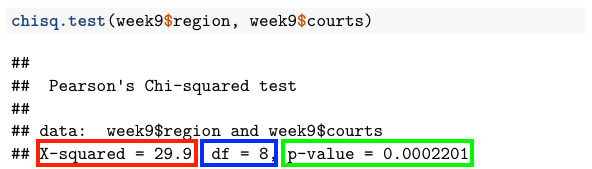
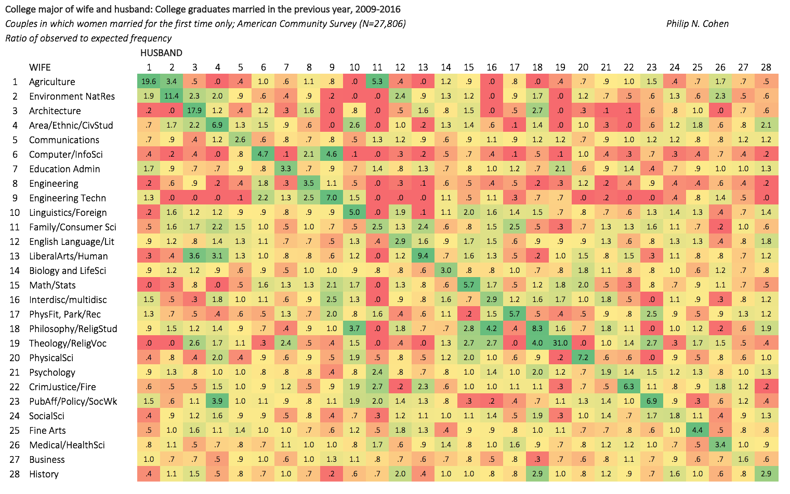

```{r setup, include=FALSE}
# Change css [here](/notes_slides/slides/metropolis.css)

options(htmltools.dir.version = FALSE)
library(xaringanthemer)
```


# Assignment 6 Review
```{r, include = FALSE}
library(tidyverse)
library(kableExtra)
load("../../data/gss_cleanup_example.Rdata")
assignment_6 <- gss_subset
rm(gss_subset)
```

--

### Cleanup

```{r}
assignment_6 <- assignment_6 |> 
  mutate(health = factor(health,
                         labels = c("Excellent", "Good",
                                    "Fair", "Poor")),
         class = factor(class,
                        labels = c("Lower", "Working",
                                   "Middle", "Upper")))
```


---

# Assignment 6 Review

### Q2. Is there a significant difference in mean hours worked last week between respondents identifying with the lower class and respondents identifying with the working class? Why or why not?

--

```{r, eval = FALSE}
t.test(assignment_6$hrs1[assignment_6$class==
                            "Lower"],
       assignment_6$hrs1[assignment_6$class==
                            "Working"])
```

---

# Assignment 6 Review 

```{r, echo = FALSE}
t.test(assignment_6$hrs1[assignment_6$class==
                            "Lower"],
       assignment_6$hrs1[assignment_6$class==
                            "Working"])
```

--

### Can reject: t more extreme than -1.96, p-value less than .05, null hypothesis value not in confidence interval

---

# Assignment 6 Review

### Q3.  Is there a significant difference in mean hours worked last week between respondents identifying with the lower class in the 2008 survey and respondents identifying with the lower class in the 2018 survey? Why or why not?

--

```{r, eval = FALSE}
t.test(assignment_6$hrs1[assignment_6$class=="Lower" &
                            assignment_6$year==2008],
       assignment_6$hrs1[assignment_6$class=="Lower" &
                            assignment_6$year==2018])
```

---

# Assignment 6 Review

```{r, echo = FALSE}
t.test(assignment_6$hrs1[assignment_6$class=="Lower" &
                            assignment_6$year==2008],
       assignment_6$hrs1[assignment_6$class=="Lower" &
                            assignment_6$year==2018])
```

--

### Cannot reject: t less extreme than 1.96, p-value greater than .05, null hypothesis value is in confidence interval

---

# Assignment 6 Review

### Q4. Is there a significant difference in the 2018 survey in the proportion of female respondents who report having excellent or good health (vs fair or poor health) and the proportion of male respondents who report having excellent or good health (vs fair or poor health)? Why or why not?

--

```{r, message = FALSE, warning = FALSE}
# Start by making a binary value for excellent/good health 
#     vs fair/poor health
# And filter for 2018 survey

question_4 <- assignment_6 |> 
  mutate(excellent_good_health = ifelse(health == "Excellent" | 
                                          health == "Good", 1, 0)) |> 
  filter(year == 2018)

# Save frequency table
health_sex_table <- table(question_4$sex, question_4$excellent_good_health)
```

---

# Assignment 6 Review

```{r}
# Run prop.test on the saved table

prop.test(health_sex_table)
```

--

### Cannot reject: p-value greater than .05, null hypothesis value is in confidence interval

---

# Assignment 6 Review

### Q5. Is there a significant difference in the proportion of working class respondents who report having excellent (vs fair or poor health) and the proportion of middle class respondents who report having excellent health (vs fair or poor health) ? Why or why not?

--

```{r}

question_5 <- assignment_6 |> 
  filter(health != "Good") |> 
  mutate(excellent_health = ifelse(health == "Excellent", 1, 0)) |> 
  filter(class == "Working" | class == "Middle") |> 
  droplevels()

year_health_table <- table(question_5$class,
                           question_5$excellent_health)

```

---

# Assignment 6 Review

```{r}
prop.test(year_health_table)
```

--

### Can reject the null: p-value less than .05, null hypothesis value is not in confidence interval

---

# Significance and Association

### Testing significance of *differences* of proportions works when we only have two levels

--

### Today: statistical significance of *distributions* of categorical variables with two or more levels

---

# Significance and Association

### Using the `week_9.csv` file, make a table (including the sums) with `region` in the rows and `courts` in the columns

```{r, include = FALSE}
week9 <- read.csv("../../data/week_9.csv")
```

---

# Significance and Association

```{r}
addmargins(table(week9$region, week9$courts))
```

---

# Significance and Association

### Are variables dependent or independent?

--

- Dependent = Association. Knowing value of one variable helps predict value of the other variable
- Independent = No association. Knowing value of one variable does not help predict value of the other variable

--

### Will also want to know if association is strong or weak
- Often more important than only knowing about statistical significance

---

# Association and Chi-Squared Test
### With means and proportions, used t- and z-distributions

--

### Difference based on sample size and degrees of freedom

--

### Assumed a normal distribution
- CLT says distribution of sample means or sample proportions are normally distributed

---

# Association and Chi-Squared Test

### Not the same when variables have more than two options
- Political Party = Democrat, Independent, Republican
- Race, Class, Religion, Region, Marital Status, Labor Force Status, etc.

--

### For today's tests, should use non-ordered variables

--

### If we do not use a mean or create a binary variable, how do we measure significance of distribution?

---

# Chi-Squared Test

### Like previous tests, we will calculate a test statistic and convert it to a probability of getting a more extreme value

--

### Also like previous tests, we will see if that probability allows us to reject a null hypothesis

--

### $\large{H_0:}$ Region of residence and beliefs about courts are independent (no association)

--

### $\large{H_A:}$ Region of residence and beliefs about courts are dependent (association)

--

### Test Statistic Formula: $\Large{x^2 = \sum {\frac {(f_o- f_e)^2} {f_e}}}$

---

# Chi-Squared Test

--

### Two key points:
- Use frequencies (counts) rather than proportions
- Compare *observed* frequencies to *expected* frequencies

--

### Distribution is not normally distributed
- No negative test statistics, so only consider the "right-tail"
- Shape changes based on DF (but always skewed right)
- DF = (rows - 1) * (columns - 1)

--

### Test-statistic not like z-score or t-score, but p-value similar to what we have seen

--

### Still need big sample size (expected>5 *in each cell*)

---

# Chi-Squared Test - Example
### Let's look at the table of observed frequencies:

--

```{r}
addmargins(table(week9$region, week9$courts))
```

---

# Chi-Squared Test - Example

--

### If distribution of beliefs about courts is equal across regions, expected value of each cell should be: 
- (total in row * total in column) / (total in table)

--

### What is the expected value for the "Mid Atlantic, About right" cell?

--

```{r}
(985 * 1665) / 8516
```

--

### For the test statistic, we need the expected values in every cell. For now, calculate them for the other two columns in the first row...

---

# Chi-Squared Test - Example

```{r}
# For Mid Atlantic, Not Harsh Enough:
(985 * 5426) / 8516

# For Mid Atlantic, Too Harsh:
(985 * 1425) / 8516
```

---

# Chi-Squared Test - Example

### Make a table of all the expected frequencies:

--

```{r}

expected_ma <- c(192.5816, 627.5963, 164.82210)
expected_mw <- c(683.1271, 2226.2147, 584.65829)
expected_ne <- c(86.0263, 280.3476, 73.62612)
expected_se <- c(335.3071, 1092.7184, 286.97452)
expected_we <- c(367.9580, 1199.1231, 314.91898)

expected_table <- rbind(expected_ma, expected_mw, 
                  expected_ne, expected_se, expected_we)
rownames(expected_table) <- c("Mid Atlantic", "Midwest", 
      "New England", "Southeast", "West")
colnames(expected_table) <- c("About right", 
      "Not harsh enough", "Too harsh")
```

---

# Chi-Squared Test - Example

```{r, eval = FALSE}
expected_table
```

```{r, echo = FALSE}
expected_table <- round(expected_table, 3)
kable(expected_table, align = rep('c', 3))
```

---

# Chi-Squared Test - Example

### And save the observed frequencies (without the marginals)

```{r}
observed_table <- table(week9$region, week9$courts)
```

---

# Chi-Squared Test - Example

### The difference between each observed and expected value is the *residual*

--

```{r, eval = FALSE}
residual_table <- observed_table - expected_table
```

---

# Chi-Squared Test - Example

```{r, echo = FALSE}
residual_table <- round((observed_table - expected_table),3)
kable(residual_table, align = rep('c', 3))
```

---

# Chi-Squared Test - Example

### Formula: $\large{x^2 = \sum {\frac {(f_o - f_e)^2} {f_e}}}$

--

### For each cell, square the residual and divide it by the expected frequency

--

### Squaring the difference always gives a positive value, which is why we are only working with the right-tail probabilities

--

```{r, eval = FALSE}
chi2_table <- (residual_table^2)/expected_table
chi2_table
```

---

# Chi-Squared Test - Example

```{r, echo = FALSE}
chi2_table <- round(((residual_table^2)/expected_table),3)
kable(chi2_table, align = rep('c', 3))
```

---

# Chi-Squared Test - Example

### Test statistic is the sum of all the values of $\large{\frac {(f_0 - f_e)^2} {f_e}}$

--

```{r}
sum(chi2_table)
```

--

### Degrees of Freedom = (#rows - 1)(#columns - 1)

--

```{r}
(5-1)*(3-1)
```

---

# Chi-Squared Test - Example

### If test statistic is greater than our cutoff, we can reject the null hypothesis that the variables are independent

--

### To find the cutoff, use `qchisq()` with the degrees of freedom. Note that in the chi-squared test, we only use the area to the right, so for .05 we use .95 (not .975 like the two-tailed t-test):

--

```{r}
qchisq(.95, df = 8)
```

---

# Chi-Squared Test - Example

### With DF=8, need a chi-squared test statistic at least as big as 15.50731 to reject the null hypothesis.

--

### With our test statistic of 29.9, we can reject the null

--

### Can also convert to p-value

--

```{r}
1 - pchisq(29.9, df = 8)
```

--

### There is a .0002 chance of getting a test statistic more extreme than our test statistic. That is less than .05 so we can reject the null hypothesis that the variables are independent.

---

# Chi-Squared Test - Example

### Shortcut in `R`:

--

```{r}
chisq.test(week9$region, week9$courts)
```

---

# Chi-Squared Test - Example



### Test statistic in red, degrees of freedom in blue, p-value in green

---

# Chi-Squared Test - Example

### Try one more: Is there a significant association between `region` and `nateduc` ("Are we spending too much on education")?

--

```{r, echo = FALSE, results = 'asis'}
region_nateduc_table <- table(week9$region, week9$nateduc)
kable(region_nateduc_table, align = rep('c', 3)) |>  kable_styling()
```

---

# Chi-Squared Test - Example

```{r}
chisq.test(week9$region, week9$nateduc)
```

--

### Cannot reject the null hypothesis that the variables are independent. Need a test statistic of 15.51, but our test statistic is less than that. And our p-value is greater than .05.

---

# Real World Relevance!

--



---

# Chi-Squared Test - Exercises

### Test a pair where you think there would be a significant association

### Test a pair where you do not think there would be a significant association

---

# Stop Here On Monday
