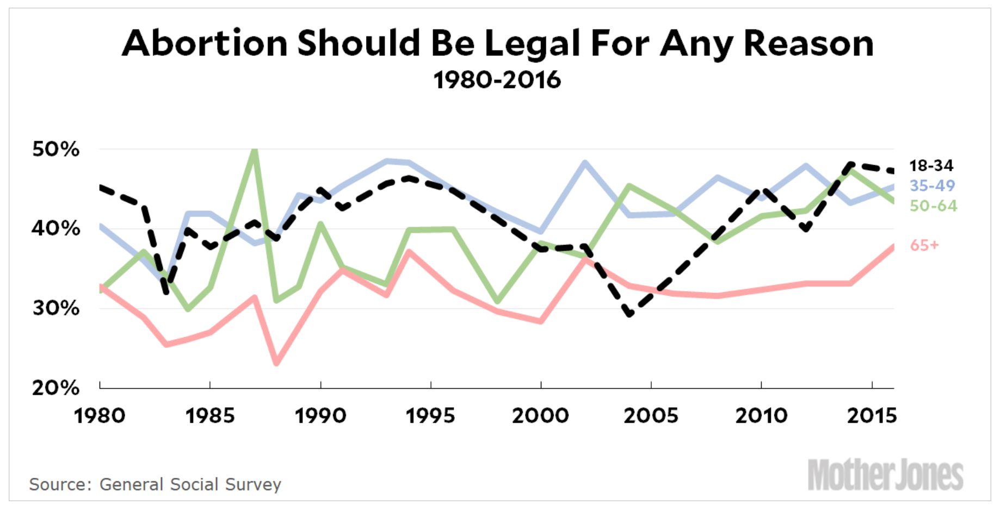
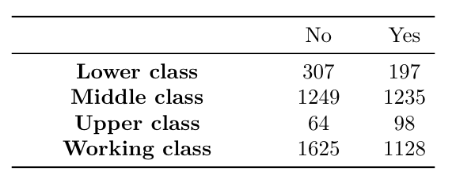
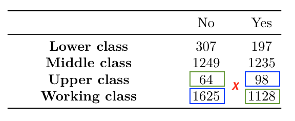

```{r setup, include=FALSE}
# Change css [here](/notes_slides/slides/metropolis.css)

options(htmltools.dir.version = FALSE)
library(xaringanthemer)
```


```{r, include = FALSE}
#week9 <- read.csv("https://raw.githubusercontent.com/mjclawrence/soci385_f21/main/data/week_9.csv")
week9 <- read.csv("../../data/week_9.csv")
library(tidyverse)
library(pander)
library(kableExtra)
```

# Quick Review

### On Monday, we were looking at associations between non-ordered categorical variables

### As a refresher, use the same `week_9.csv` file and test if there is a significant association between class and marital status. Let's first look at the frequency table or proportion table.

---

# Quick Review

```{r, echo = FALSE, results = 'asis'}

class_marital_table <- table(week9$class, week9$marital)
class_marital_proptable <- round(prop.table(class_marital_table,1),3)

kable(class_marital_table, align = rep('c', 4))
```

<br />

```{r, echo = FALSE, results = 'asis'}
kable(class_marital_proptable, align = rep('c', 4))
```

---

# Quick Review

### Now let's test if we can reject the null hypothesis that the two variables are independent

--

```{r, eval = FALSE}
chisq.test(week9$class, week9$marital)
qchisq(.95, df = 9)
```

---

# Quick Review

```{r, echo = FALSE}
chisq.test(week9$class, week9$marital)
qchisq(.95, df = 9)
```

--

### To reject the null, we need a test statistic greater than 16.92 and a p-value less than .05. We can reject the null hypothesis that the two variables are not associated (or that they are independent). 

---

# Adapting The Chi-Squared Test

### Recall that to use the chi-squared test, the expected frequency in each cell must be at least five.

--

### To see the expected frequencies for each cell:

--

```{r, eval = FALSE}
chisq.test(week9$class, week9$marital)$expected
```

--

### Idea here is to think of the test function as the data frame and `expected` as the variable

---

# Adapting The Chi-Squared Test

```{r, echo = FALSE, results = 'asis'}
class_marital_chisq <- round(chisq.test(week9$class,
                                        week9$marital)$expected,2)

kable(class_marital_chisq, align = rep('c', 4))
```

--

### All our cells have more than five expected frequencies, so it is fine to use the chi-squared test

---

# Adapting The Chi-Squared Test

### What if we want to test this association only for respondents who were not born in this country?

--

```{r}
immigrant <- filter(week9, born == "No")
chisq.test(immigrant$class, immigrant$marital)
```

--

### The warning is because we do not have at least five expected frequencies in each cell:

---

# Adapting The Chi-Squared Test 

```{r, eval = FALSE}
chisq.test(immigrant$class, immigrant$marital)$expected
```

--

```{r, echo = FALSE, results = 'asis'}
immigrant_class_marital_chisq <- round(chisq.test(immigrant$class,
                                        immigrant$marital)$expected,2)

kable(immigrant_class_marital_chisq, align = rep('c', 4))
```

---

# Adapting The Chi-Squared Test

### If expected frequency in any cell is less than 5, use Fisher's Exact Test

--

```{r, eval = FALSE}
fisher.test(immigrant$class, immigrant$marital,
      simulate.p.value = TRUE)
```

---

# Small Samples

```{r, echo = FALSE}
fisher.test(immigrant$class, immigrant$marital,
      simulate.p.value = TRUE)
```

--

### Output provides a p-value but not a test statistic

### In this case, we can reject the null because the p-value is less than .05

---

# Interpreting Tests of Association

### Test statistic tells us if we can reject the null; i.e., if there is dependence between rows and columns

--

### Does not tell us about *strength* of association

--

### Let's think about the relationship between class and beliefs about abortion (the `abany` variable). 

---

# GSS In The News



---

# Measuring Association

### How would you describe the proportion table? Are the variables dependent or independent?

--

```{r, echo = FALSE}
round(prop.table(table(week9$class ,week9$abany),1),3)

chisq.test(week9$class, week9$abany)
```

---

# Measuring Association

### Want to know about *strength* of association between class and abortion beliefs
- Big test statistic does not necessarily mean stronger association

--

### Interpreting association through odds is more intuitive and based on probability

--

### We'll build back to proportion of upper class respondents who believe abortion should be possible for any reason  = .605

---

# Measuring Association

### Odds of supporting abortion rather than not supporting = probability of success / probability of failure

--

```{r}
# For Upper Class:
.605 / (1-.605)
```

--

### Upper class respondents are 1.532 times as likely to support abortion in any case than to not do so. That's the same as saying they are 53.2% more likely to support than not support abortion in any case.

---

# Measuring Association


### Probability of supporting abortion = odds / odds + 1

--

```{r}
1.532 / (1 + 1.532)
```

---

# Another Example

### What are the odds of supporting abortion for working class respondents?

--

```{r}
.410/ (1-.410)
```

--

### This time the result is less than 1. So working class respondents are .695 times as likely to support abortion as they are to not support abortion. That's the same as saying they are 30.5% less likely to support rather than not support abortion.

--

### Takeaway: When odds are less than 1, percentage is 1 - odds. When odds are greater than 1, percentage is odds - 1.

---

# Measuring Association - Odds Ratio

### Odds Ratio: Odds of support for upper class / Odds of support for working class

--

```{r}
1.532 / .695
```

--

### In words: Odds that an upper class respondent supports abortion are 2.2 times the odds that a working class respondent supports abortion

--

### Unlike $x^2$, higher values do mean stronger association

--

### Also called the cross-product ratio...

---

# Measuring Association - Odds Ratio

### Back to the frequency table:



---

# Measuring Association - Odds Ratio

### Cross Product Ratio:



---

# Measuring Association - Odds Ratio

```{r}
(98*1625) / (64*1128)
```

--

### Foundation for advanced statistical methods (like logistic regression)

---

# Association Between Ordered Variables

### Chi-squared and Fisher's Exact tests work when at least one of your categorical variables is not ordered

--

### Ordinal variables require different tests for association
- Ordinal variables: education, income, age
- Ordinal scales: poor, fair, good, excellent; disagree - agree

---

# Association Between Ordered Variables

### For ordinal variables, association works somewhat likes correlation
- Positive association means higher values of one variable tend to be paired with higher values of the other variable, and lower values of one variable tend to be paired with lower values of the other variable
- Negative association means higher values of one variable tend to be paired with lower values of the other variables, and lower values of one variable tend to be paired with higher values of the other variable
- No association means no clear relationship between the variables

---

# Association Between Ordinal Variables

### Several different methods, but they are very similar. We'll focus on the Goodman Kruskal gamma test.

--

### gamma always between -1 and 1 (like a correlation)
- Positive gamma means positive association (high with high, low with low)
- Negative gamma means negative association (high with low, low with high)

---

# Association Between Ordinal Variables

### Calculations by hand are messy
- Across the table, compare *concordant pairs* (higher and higher) and *discordant pairs* (higher and lower)
- We'll skip to the shortcut, but first let's look at the cross-table of `year` and `courts`

--

```{r, eval = FALSE}
table(week9$year, week9$courts)
```

---

# Association Between Ordinal Variables

```{r, echo = FALSE, results = 'asis'}
year_courts_table <- table(week9$year, week9$courts)

kable(year_courts_table, align = rep('c', 3))
```

---

# Association Between Ordinal Variables

### The `courts` variable is not ordered, so we have to do that before continuing:

--

```{r}
week9 <- mutate(week9, courts = factor(courts,
                       levels = c("Not harsh enough",
                                  "About right",
                                  "Too harsh")))
```

---

# Association Between Ordinal Variables

### Check the table again with the re-ordered variables, and save the table as an object

--

```{r, echo = FALSE, results = 'asis'}
year_courts_table <- table(week9$year, week9$courts)
kable(year_courts_table, align = rep('c', 3))
```

---

# Association Between Ordinal Variables

### Check the proportion table as well:

```{r, echo = FALSE, results = 'asis'}
year_courts_proptable <- round(prop.table(year_courts_table,1),3)
kable(year_courts_proptable, align = rep('c', 3))
```

---

# Association Between Ordinal Variables

###The `GKgamma()` function (for the Goodman Kruskal test) is in the `vcdExtra` package. Install and load the package.

```{r, echo = FALSE, warning = FALSE, message = FALSE}
library(vcdExtra)
```

--

### Like `prop.test()`, all `GKgamma()` needs is a table:

--

```{r, eval = FALSE}
GKgamma(year_courts_table)
```

---

# Association Between Ordinal Variables

```{r, echo = FALSE}
GKgamma(year_courts_table)
```

--

### Gamma statistics run from -1 to 1. First thing to note is that there is a positive association between year and courts.

---

# Association Between Ordinal Variables

### To test if the association is significant, divide gamma by its standard error:

--

```{r}
.069 / .015
```

--

### This is the number you want to compare to 1.96 (for 95% significance level). 

--

### In this case, we can reject the null hypothesis since 4.6 is more extreme than 1.96. So there is a significant positive association between year and courts

---

# Ordinal Variables - Exercise

### What about `class` and `courts`?

--

```{r}
# Order the levels of class:
week9 <- mutate(week9, class = factor(class, 
               levels = c("Lower class", "Working class", 
                          "Middle class", "Upper class")))

# Save the table as an object:
class_courts_table <- table(week9$class, week9$courts)
```

---

# Ordinal Variables - Exercise

```{r}
GKgamma(class_courts_table)
```

--

### Small positive association

--

```{r}
.035 / .018
```

---

# Ordinal Variables - Exercise

### What about `degree` and `nateduc`?

--

```{r}
# Order the levels of degree:
week9 <- mutate(week9, degree = factor(degree, 
               levels = c("Lt high school", "High school", 
                          "Junior college", "Bachelor", "Graduate")))

# Order the levels of nateduc:
week9 <- mutate(week9, nateduc = factor(nateduc, 
               levels = c("Too little", "About right", "Too much")))

# Save the table as an object:
degree_nateduc_table <- table(week9$degree, week9$nateduc)
```

---

# Ordinal Variables - Exercise

```{r}
GKgamma(degree_nateduc_table)
```

--

### Negative association means higher degree categories tend to be associated with responses that are lower on the `nateduc` scale

--

```{r}
-.147 / .025
```

--

### And it is significant because -5.88 is more extreme than -1.96

---

# Association Cheat Sheet

### Two categorical variables (both nominal, or one nominal and one ordered) with at least five expected counts in each cell:
- `chisq.test()` with two variable names

### Two categorical variables (both nominal, or one nominal and one ordered) with less than five expected counts in any cell:
- `fisher.test()` with two variable names. Remember to add `simulate.p.value=TRUE`

### Two ordered categorical variables:
- `GKgamma()` with name of saved table, after loading the `vcdExtra` package and ordering variables if necessary