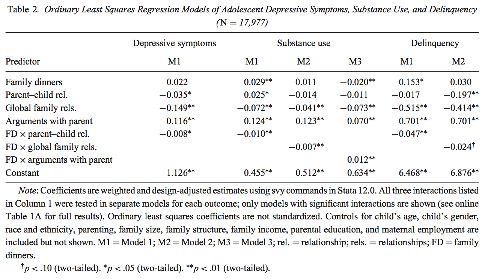
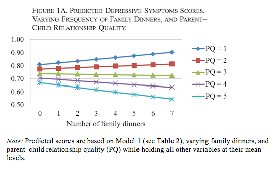
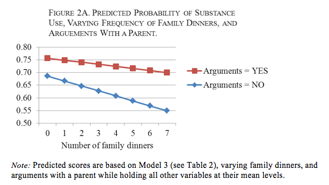
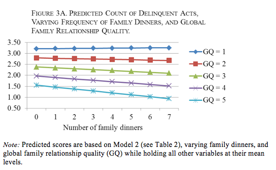

```{r setup, include=FALSE}
# Change css [here](/notes_slides/slides/metropolis.css)

options(htmltools.dir.version = FALSE)
library(xaringanthemer)
```


```{r, include = FALSE, warning = FALSE}
midd_survey <- read.csv("https://raw.githubusercontent.com/mjclawrence/soci385_f21/main/data/midd_survey.csv")
library(tidyverse)
library(huxtable)
library(xaringan)
library(kableExtra)
```


# Assignment 8 Review

### 1. Create a new binary variable identifying respondents who think they are most likely to find a marriage or long-term partner at Middlebury with a 1 and everyone else with a 0.

--

```{r, header = FALSE}
midd_survey <- mutate(midd_survey, 
                      find_partner_midd =
                           ifelse(find_partner=="Middlebury",1,0))
```

--

### What is the mean of this new variable, and what does that value represent?

```{r}
mean(midd_survey$find_partner_midd)
``` 

--

The mean of this binary variable is the proportion of respondents who think they are most likely to find a marriage or long-term partner at Middlebury.

---

# Assignment 8 Review

### How does this vary by gender?

```{r}
prop.table(table(midd_survey$gender, midd_survey$find_partner_midd),1)
```

--

No respondents in the "Other" gender category think they will find their partner at Middlebury. Let's take them out of the dataset so the rest of the models are easier to interpret.

--

```{r}
midd_survey <- midd_survey |>
     filter(gender!="Other") |>
     droplevels()
```

---

# Assignment 8 Review

### 2. Regress the binary variable you created in #1 on gender, and interpret the coefficients.

--

```{r, eval = FALSE}
model1 <- 
      lm(find_partner_midd ~ gender, 
      data = midd_survey)

summary(model1)
```

---

# Assignment 8 Review

```{r, echo = FALSE}
model1 <- 
      lm(find_partner_midd ~ gender, 
      data = midd_survey)

summary(model1)
```

---

# Assignment 8 Review

### On average, women are 3.5 percentage points less likely than men to think they will find a partner at Middlebury. This difference is significant.

---

# Assignment 8 Review

### 3. Add type of housing as a control variable to the model, and interpret the coefficients. 

--

```{r, eval = FALSE}
model2 <- 
      lm(find_partner_midd ~ gender + housing, 
      data = midd_survey)

summary(model2)
```

---

# Assignment 8 Review


```{r, echo = FALSE}
model2 <- 
      lm(find_partner_midd ~ gender + housing, 
      data = midd_survey)

summary(model2)
```

---

# Assignment 8 Review

### Controlling for housing type, there is still a significant difference of 3.5 percentage points between men and women on average.

### Or, controlling for gender, students living in dorms, in houses and off campus are equally likely to expect to find a partner at Midd, on average.

---

# Assignment 8 Review

### 4. Add an interaction between gender and type of housing to the model, and interpret the coefficients.

--

```{r, eval = FALSE}
model3 <- 
      lm(find_partner_midd ~ gender * housing, 
      data = midd_survey)

summary(model3)
```

---

# Assignment 8 Review

```{r, echo = FALSE}
model3 <- 
      lm(find_partner_midd ~ gender * housing, 
      data = midd_survey)

summary(model3)
```

---

# Assignment 8 Review

### The differences between men and women vary across types of housing. The average differences between men and women are significantly larger for those who live in houses rather than dorms and for those who live off campus rather than in dorms. 

---

# Assignment 8 Review

### 5. Save the predicted values from the model in #4. Create a table with `group_by()` and `summarize()` showing how the predicted values differ by gender and housing type. Interpret any interesting results.

--

```{r, eval = FALSE}
midd_survey$pred_find_partner <- model3$fitted.values

find_partner_predictions <- midd_survey |>
     group_by(gender, housing) |>
     summarize(prob_find_partner = 
      round(mean(pred_find_partner, na.rm=TRUE),3))
```

---

# Assignment 8 Review

```{r, echo = FALSE, error = FALSE, warning = FALSE, message = FALSE}
midd_survey$pred_find_partner <- model3$fitted.values

find_partner_predictions <- midd_survey |>
     group_by(gender, housing) |>
     summarize(prob_find_partner = round(mean(pred_find_partner),3))

colnames(find_partner_predictions) <- c("Gender", "Housing", "Proportion")

kable(find_partner_predictions, align = rep("c", 2))
```

---

# What are the interactions doing?

Consider the difference in the proportions between men in dorms (.058) and women in dorms (.047). That drop of .011 from men to women reflects the coefficient for women (-.011).

If there were no significant interaction terms, the drop of -.011 between men and women in dorms is what we would also expect as the drop between men and women in houses and between men and women in off campus housing. But the predicted differences in those housing types are much greater. That's because the interaction term tells us to add a certain amount to the predicted difference between men and women in those housing types.

For houses, start with .011 and add .113. That explains the .124 difference between men in houses (.135) and women in houses (.011).

For off campus, start with .011 and add .120. That explains the .131 difference between men off campus (.130) and women off campus (.000)...with some minor rounding errors.

---

# Getting Output Out Of R

### Final project's report should not have R output. Will discuss formatting more on Wednesday
- Figures should have titles
- Use the `huxtable` package for tables

- Let's turn to the `huxtable.Rmd` notebook...

---

# Previewing Huxtable

```{r, echo = FALSE, comment = FALSE}
huxreg(model1, model2, model3, 
       statistics = c("N. obs." = "nobs"),
       coefs = c("(Intercept)" = "(Intercept)",
                  "Gender = Woman" = "genderWoman", 
                 "Housing = House" = "housingHouse",
                 "Housing = Off Campus" = "housingOff Campus",
                 "Woman x House" = "genderWoman:housingHouse",
                 "Woman x Off Campus" = "genderWoman:housingOff Campus")) |>
  theme_compact()
```

---

# Meier and Musick (2014)

### Motivation?

--

### Research Question?

--

### Hypotheses?

--

### Data?
- Dependent Variables?
- Independent Variable?
- Control Variables?

---

# Meier and Musick (2014)



---

# Meier and Musick (2014)



---

# Meier and Musick (2014)



---

# Meier and Musick (2014)



